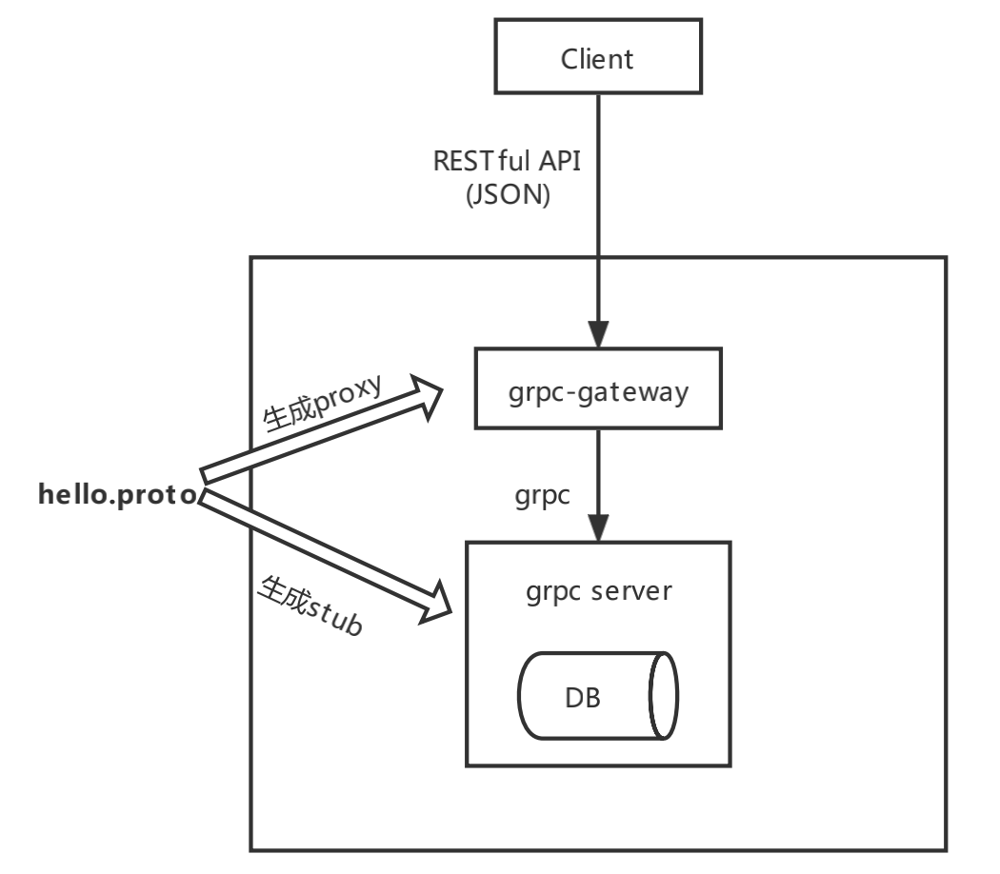
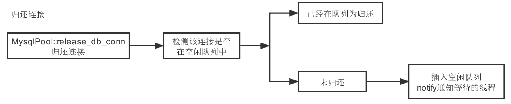

## 1、概述

### 1.1 需求背景

- 设计一个 **订单查询** 系统，为商户提供  “订单查询” 的功能
- 功能原型参考：https://pay.weixin.qq.com/wiki/doc/apiv3/apis/chapter3_2_2.shtml
  - 本次实现了上述连接中第2个接口，商户订单号查询

### 1.2 接口要求

**接口说明：**

请求URL： https://api.mch.weixin.qq.com/v3/pay/transactions/out-trade-no/{out_trade_no}

请求方式：GET

**请求参数：**

直连商户号（mchid）

商户订单号（out_trade_no）

**返回参数：**

具体见`功能原型链接`

## 2、总体设计

### 2.1 整体架构

grpc-gateway读取protobuf定义生成反向代理服务器，将RESTful API转换为gRPC，同时也将gRPC转为RESTful API

具体流程：

1）当HTTP请求到达grpc-gateway时，它将JSON数据解析为Protobuf消息

2）grpc-gateway发出grpc客户端请求，将消息发送值grpc服务端

3）当收到grpc服务端的应答消息，将protobuf消息编码为JSON并返回给客户端

### 2.2 模块划分

服务端分两个模块：

1）grpc网关

2）grpc服务

`server` 的主要模块说明如下:

- 异步服务器

  - 通过grpc异步API实现
  - 在RPC调用上绑定一个 `CompletionQueue`，读或写事件以唯一的 `void*` 变量展示
  - 代码中使用 `QueryInfo` 对象去维护每个RPC的状态，并使用这个对象的地址作为调用的唯一标签，这样可以使得不同的 `QueryInfo` 实例可以同时处理不同的请求

- 数据存储

  采用mysql连接池，创建连接池使用线程安全的单例模式

  

### 2.3 安全性

由于时间关系，代码上还没加入安全相关的操作，但是在设计上，有这方面的考虑。

- 使用https

- 使用TLS/SSL，对请求和响应中的敏感数据进行加密

- 请求中携带数字签名

  1）客户端将请求参数+时间戳使用约定好的秘钥进行加密，得到签名值signature，将签名值也放入请求参数中，发送请求给服务端

  2）服务端接收客户端的请求，使用约定好的秘钥对参数的请求再次进行签名（除了signature），得到签名值autosign

  3）服务端对比autosign和signature一致，并验证时间戳是否在合理的范围内，来判断是否是合法请求

## 3、重要数据结构

`business_order` 商户订单表，存储商户订单的所有信息

使用唯一索引：unique key uk_no(mchid,out_trade_no) 

创建表的sql语句：src/mysql/create.sql

## 4、测试方案

### 4.1 功能测试

参考等价类划分法、边界值分析法

### 4.2 单元测试

对代码中每个接口都要进行测试

## 5、遇到的问题

- 使用开源的grpc-gateway是go源码，因为不熟悉go语言，并且该插件对多个工具版本有严格要求，在安装环境上耗费较多时间（已解决）
- 使用防SQL注入的方式拼接了SQL语句，但是查DB使用mysql自带的函数，语法上不兼容，需要改一下（未解决）

## 6、扩展（todo）

- 配置管理：创建配置文件config.ini，将用到的配置参数写到配置文件中，系统初始化读配置文件
- 日志管理：将日志信息打印到文件中，附带详细的时间、函数、代码行数等信息
- 数据传输安全
- 业务代码部分，考虑较少，不够完善
- 单元测试：时间原因，该部分没来得及完成（工作中有用到gtest）
- 接入流水线：时间原因，该部分没来得及完成（工作中经常会用到CICD，进行代码自动编译部署流程）

## 7、附录

代码git地址：

grpc网关  https://github.com/Elaine-Y/gateway_rp.git

grpc服务  https://github.com/Elaine-Y/project.git

 

